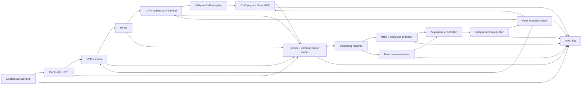

# Architecture

Status: Phase 1 architecture corrected by validated R1 contracts; R2 PHM
semantics, R3 utility-plant physics, R4 online/scenario timing, standalone
WP08 CMP physics, and WP10 declared-topology coupling are validated. Canonical
schema 2.4.0, interface registry 3.2.0, and DynamicSubsystem 2.0.0 are frozen.
Virtual metrology, prediction, and control remain pending.

## Architectural intent

The system is a deterministic, modular simulation and evaluation platform with
a separate public-data virtual-metrology path. Simulation runtime components
exchange typed records in canonical SI units. Public data preserve original
native or unknown units unless a source-supported conversion exists. The
architecture enforces five boundaries: measured versus synthetic data, public
native units versus simulator SI units, latent versus observed state,
prediction versus causal attribution, and controller proposal versus
independent safety approval.

## System context and signal flow



Arrows represent information or simulated actuation, not evidence of real-fab causality.

## Two evidence planes

### Public-data plane

The PHM pipeline preserves raw files, validates provenance and schema, constructs wafer/machine/time groups, joins average-MRR labels, engineers temporally valid features, and produces leakage-safe splits. Models trained here support only average-MRR virtual-metrology claims. No public-data record is silently combined with simulator truth.

### Simulation-control plane

The simulator creates true latent trajectories and then generates sensor observations. Streaming models and controllers see only allowed observed signals and prior controller state; evaluation may compare their outputs against latent truth after the action is chosen. Simulator labels support excursion and root-cause evaluation but do not validate real equipment.

## Layered components

1. **Configuration and provenance:** versioned YAML inputs, validated typed configuration, run manifest, seed allocation, parameter provenance.
2. **Scenario engine:** ordered events, validation, deterministic replay, and compound disturbances.
3. **Dynamic plant:** electrical/UPS, VFD/motor, pump, UPW hydraulic/thermal, and CMP state models implementing `DynamicSubsystem`.
4. **Observation layer:** sensor noise, bias, drift, quantisation, rate mismatch, delay, loss, stuck values, and jitter without mutation of latent state.
5. **Inference layer:** streaming features, average-MRR predictor, future-envelope classifier, uncertainty, and root-cause estimator.
6. **Decision layer:** no-action, threshold/hysteresis, and predictive supervisory controllers that return proposed actions only.
7. **Safety layer:** independent validation, clipping, rejection, hold replacement, and controlled-resume checks.
8. **Runtime and evidence:** fixed update order, structured logs, single/batch/Monte Carlo execution, metrics, reports, and dashboard views.

Dependency direction is from higher-numbered orchestration layers toward stable lower-layer contracts; plant components never import controller, model-training, dashboard, or API code.

## Runtime sequence

For each monotonically increasing simulation timestep:

1. Read deterministic scenario events for the current time.
2. Update electrical and UPS latent state.
3. Update VFD and motor latent state.
4. Update pump latent state.
5. Update UPW hydraulic and thermal latent state.
6. Compute typed utility-to-CMP boundary conditions for the declared connection topology.
7. Update true CMP state and true simulated MRR.
8. Generate observed signals from latent state through sensor/communication models.
9. Update streaming features using observations available at or before the decision timestamp.
10. Predict MRR, uncertainty, and future-envelope excursion probability.
11. Estimate the initiating cause, including `UNKNOWN`.
12. Ask the selected controller for a proposed action.
13. Validate the proposal with the independent safety filter.
14. Store the approved, clipped, rejected, or hold-replacement action for application at the next defined actuation boundary.
15. Log events, true state, observed state, prediction, attribution, proposed action, safety decision, final action, timing, and provenance.

The one-step action timing convention prevents algebraic loops and target leakage. If Phase 3 requires a different actuation boundary, it must be an interface-impacting decision.

## Physical-model disposition after R3

Pump affinity relations remain homologous curve-scaling checks around a
reference point with normalized speed \(n=\omega/\omega_0\). R3 implements

\[
H_p(Q,n,d)=dH_{shut}n^2-k_QQ^2.
\]

Canonical units are m³/s, Pa, and W. Flow is solved from the curve at current
network differential pressure; the cube law is checked only at homologous
points. The UPW step then solves the unique backward-Euler compliance balance
with explicit tool, return, relief, and storage flows. Pressure is not clipped,
and every step checks a discrete mass residual. UPS output frequency and
battery energy/load are explicit. The former emitted S/m conductivity proxy is
replaced by a dimensionless synthetic deviation index. Equations, numerical
evidence, and limitations are in
`orchestration/reports/r3_plant_physics_validation.md`.

The withdrawn initial CMP proposal used the scalar Preston relation below; it
is retained only as a baseline to compare, not as the integrated model:

\[
MRR_{physics}=K P_c V_{rel} \prod_i m_i(x_i),
\]

The WP08 replacement implements explicit process modes, signed dynamic
spindles, area-averaged
pressure--relative-velocity exposure, dynamic pad/dresser/slurry/thermal
states, and cumulative removal. Its input is a neutral typed boundary; declared
dressing-water, thermal, synthetic slurry-support, and no-connection utility
topologies are implemented by a stateless `UtilityToCmpCoupler`. The coupler
accepts only latent `UpwState`, never observations or raw electrical/pump
signals, and emits only the frozen CMP boundary. A direct generic UPW-to-MRR
multiplier is prohibited. Frozen equations and validation evidence are in
`orchestration/decisions/wp08_cmp_physics.md` and
`orchestration/reports/wp08_cmp_validation.md`, with coupling evidence in
`orchestration/reports/wp10_coupling_validation.md`.

The public-data virtual-metrology structure is fitted in the PHM target's
native numeric unit:

\[
\widehat y_{native}=\widehat y_{physics,native}+f_\theta(x).
\]

The physics term uses dimensionless phase-aware proxies and train-only
coefficients. It is never an SI simulator prediction added to scaled PHM data.
Physics calibration, residual fitting, uncertainty calibration, and official
holdout evaluation must remain isolated.

## State and observation separation

- `StateRecord` contains simulator truth and is available to plant integration, scenario truth, and post-run evaluation.
- `ObservationRecord` contains source, reported, and arrival timing plus sensor values and quality flags. A queued record becomes visible online only when its arrival is no later than the decision cutoff; it is the only plant information available to online features, predictors, attribution, controllers, and safety checks.
- Sensor corruption reads latent state but cannot write it.
- A sensor fault is recorded independently from the physical quantity it observes.
- Evaluation joins state and observation by run and step only after online decisions are finalized.

## Controller and safety separation

Controllers implement a common interface and cannot directly mutate plant state. They emit typed proposed actions with target, value, effective time, rationale, and confidence. The safety filter receives the proposal plus current observations, prediction uncertainty, and configured constraints. It returns one of:

```text
APPROVED
CLIPPED
REJECTED_OUT_OF_ENVELOPE
REJECTED_SENSOR_INVALID
REJECTED_HIGH_UNCERTAINTY
REPLACED_WITH_HOLD
```

Only the returned final action reaches the runtime actuator boundary. Hold and restart transitions are explicit state machines, not boolean shortcuts.

The Phase 3 primary predictive policy is deliberately narrower than the
canonical action vocabulary. The validated disturbance mechanism creates
under-removal after loss of dressing-water support, while the nominal VFD and
valve commands are already maximal and the permitted CMP numerical actions are
reductions. The primary policy therefore enables only `NO_ACTION`,
`ADVISORY_WARNING`, `SAFE_HOLD`, and `CONTROLLED_RESUME`; numerical actions
remain independently bounded but disabled.

Recipe progress is a separate clock from wall time. `HOLD` and `RECOVER`
freeze recipe-phase progress, and a controlled resume restores and completes
the interrupted phase. Paired evaluation is aligned by active-polish progress
and requires equal recipe completion, so holding cannot shorten the evaluated
recipe. The required primary threshold baseline is an arrived-MRR hysteresis
controller; an earlier upstream utility-threshold controller is a mandatory
fourth comparator and cannot be hidden.

The safety filter is separately configured and may not import a controller.
It checks proposal timing and schema, arrived-sensor validity, predictor and
topology binding, uncertainty/applicability, process mode, magnitude, slew,
hold, and restart conditions. During `DRESS`, loss of conditioning service is
a simulated quality-risk mechanism rather than a validated equipment hazard,
so automatic utility-continuation holds apply only in `PREPARE` and `POLISH`.

## Determinism and time

- Simulation time is integer `step_index` plus `timestamp_s = step_index * dt_s`; floating-point timestamps are never used as primary keys.
- Every stochastic component receives a named child seed derived from the run seed.
- Event ordering for equal timestamps is stable by priority then declaration order.
- Configuration, code version when available, dataset checksum, seed map, and platform versions are logged.
- Deterministic regression traces remain small and store canonical values with declared tolerances.

## Configuration boundaries

- `configs/default.yaml` supplies the current WP10 synthetic baseline with
  `NO_CONNECTION`. Its canonical runtime hash is
  `b2b07edbaad458f6f66cf26ce88ffc5deef656a33701a7cccd8da94104d7383f`.
  Frozen R3/R4 hashes and the WP08 hash remain reproducible under versioned
  serialization compatibility.
- Scenario files define events, not component implementation.
- Controller files define objectives, limits, horizons, and thresholds, not plant parameters.
- Dataset manifests define provenance and schema expectations, never credentials.
- Unknown configuration keys are rejected.

## Planned package boundaries

```text
src/semifab_poc/
├── config.py                 # configuration validation and composition
├── logging.py                # structured local run logging
├── cli.py                    # command entry points
├── data/                     # manifests, validation, PHM transforms, splits
├── simulation/               # scenario and dynamic plant components
├── models/                   # VM, warning, uncertainty, attribution
├── control/                  # controllers, constraints, safety filter
├── evaluation/               # paired experiments, metrics, reports
├── dashboard/                # read-only visualization of run artifacts
└── api/                      # typed public package facade; no production control
```

Cross-package imports must follow the dependency graph. Notebooks and the dashboard may call package APIs but may not contain unique domain logic.

## Failure containment

State is immutable across a failed step: the runtime computes candidate next states, validates finiteness, units/ranges, and invariants, then commits the step atomically to the in-memory trajectory. A numerical or invariant failure stops the run, preserves the last valid state and configuration, and triggers the project failure-report process during development.

## Phase 3 scientific freeze

Phase 3 has frozen the following design decisions for bounded Phase 4
implementation:

- the paired-reference active-polish MRR envelope, 0.25 s persistence, and
  3.0 s prediction horizon;
- calibrated probability plus conformal-set uncertainty and explicit
  topology/configuration applicability checks;
- the finite predictive action set, lexicographic objective, probability
  gates, process-clock semantics, latency budgets, and fallback policy;
- the primary process-MRR threshold comparator and mandatory upstream
  utility-threshold comparator;
- independent synthetic action envelopes, slew limits, sensor-validity rules,
  uncertainty rejection, fail-closed behavior, and controlled-resume dwell;
  and
- new seed ranges, equal-recipe paired comparisons, bootstrap requirements,
  success thresholds, non-inferiority tolerances, and negative-control gates.

The frozen contracts are documented in
`orchestration/decisions/wp15_predictive_supervisory_control.md` and
`orchestration/decisions/wp16_independent_safety_filter.md`. Phase 4 still must
implement the baseline controllers, predictive state machine, independent
safety filter, and integrated runtime and then evaluate them without retuning
the frozen TEST criteria. No controller-efficacy or safety-enforcement result
is implied by the architecture freeze.
