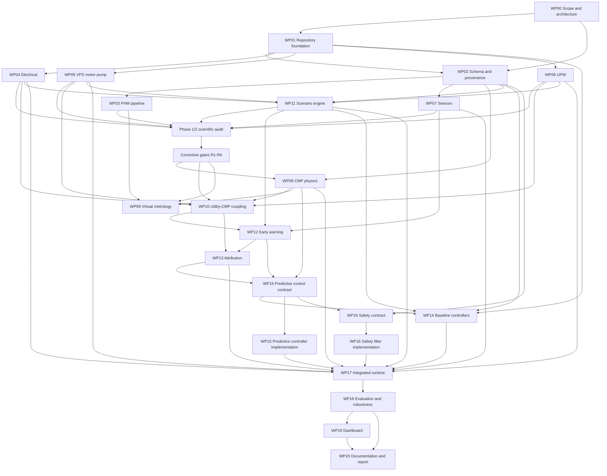

# Dependency graph

## Work-package DAG



The arrows indicate acceptance dependencies, not necessarily Python imports. The architecture forbids upward plant-to-controller imports even where the work-package DAG has downstream consumers.

## Phase gates

| Gate | Required complete evidence | Unlocks |
|---|---|---|
| G1 Planning freeze | Repository assessment, charter, claims, architecture, schema, interfaces, assumptions, risks, DAG, manifest, plan, validation checkpoint | Phase 2 foundation |
| G2 Routine foundation | Historical Phase 2 implementation and its original 60-test suite | Retrospective scientific audit only; this gate is provisional |
| G2R Corrective scientific gate | R1 contracts/configuration, R2 PHM semantics, R3 conserved plant physics, and R4 causal online/scenario timing all validated | T-WP08, T-WP09, and T-WP10 implementation |
| G3 Scientific freeze | Equations/units reviewed, coupling provenance/sensitivity validated, MRR target/horizon and uncertainty frozen, attribution bounded, controller objective/actions/baselines and independent safety envelope frozen with feasibility and comparison gates | Phase 4 baseline, controller, safety, runtime, evaluation, and communication implementation |
| G4 Integrated candidate | Full runtime, three controllers, robustness scenarios, dashboard/report generators, standard tests | Phase 5 audit |
| G5 Final audit | Clean install, full tests, reproducibility, claim/data/safety audits, final report | PoC completion |

## Critical path

```text
WP00 → WP01 → WP02 → Phase 1/2 audit → R1–R4 remediation → WP08 → WP10 → WP12 → WP13 → WP15 contract → WP16 contract → WP15/WP16 implementation → WP17 → WP18 → WP20
```

WP03 and WP09 form a separate public-data evidence path. The PHM archive is
locally present; raw integrity/schema, native-unit handling, source-order
phase-aware time weighting, anomaly-policy materialization, source-role
construction, R2.1 whole-wafer precedence, and inner grouped splits pass R2.
The source partitions themselves reuse wafer IDs, so only the retained
1,981/311/275 roles support independent-wafer evaluation. A physical-machine
holdout is not possible because only machine ID 2 is present. WP09 public
virtual metrology is complete on the retained roles: C-001 is narrowly
supported for offline point prediction, whereas public-data C-008 and the
model-family-independent C-009 gate are rejected. None of those data calibrates
the SI simulator-control path.

## Data dependencies

- PHM raw bytes → immutable raw manifest/checksum → schema validation → label join → grouped split → feature transforms → VM models → public-data metrics.
- Scenario YAML + component parameters + named seeds → exogenous event trace → plant truth → sensor observations → streaming features → predictions/attribution → proposed action → safety decision → final action → paired metrics.
- Simulator truth and cause labels are evaluation-only inputs. They never flow into online features or decisions.

## Readiness rules

1. A task becomes `READY` only when all dependencies are `COMPLETE`, its required input contracts exist, file ownership is non-conflicting, and no blocker requires user action.
2. Completing a task triggers review of direct dependants and explicit manifest state updates.
3. A task cannot advance from `IMPLEMENTED` to `VALIDATED` without all acceptance tests.
4. A phase checkpoint can set its bounded planning tasks to `COMPLETE`; implementation tasks remain at their truthful states.
5. Public-data acquisition and validation never become ready solely because simulator development succeeds.
6. A retrospective audit may preserve a historical `COMPLETE` state while
   adding a new corrective gate; downstream tasks must depend on that gate and
   may not rely on the earlier checkpoint as scientific acceptance.
