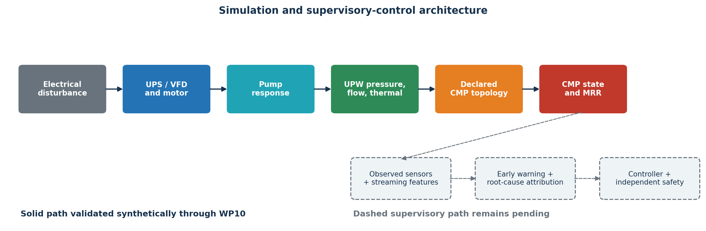
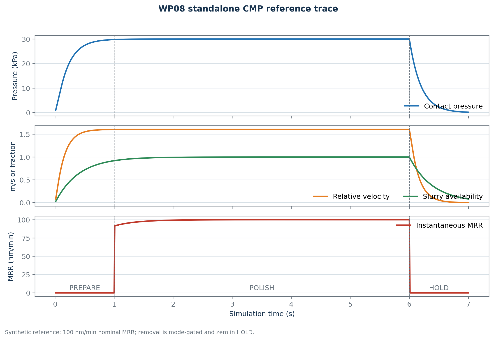
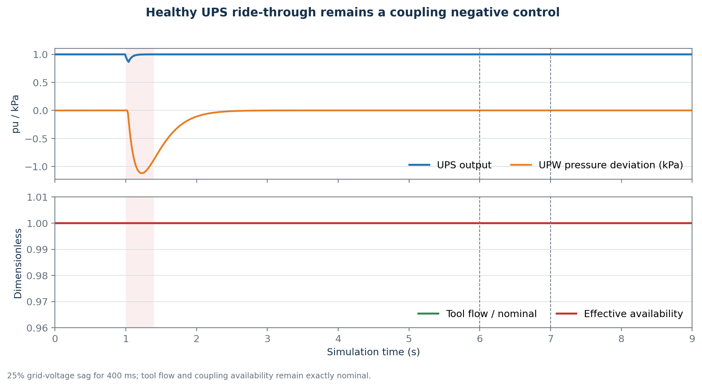
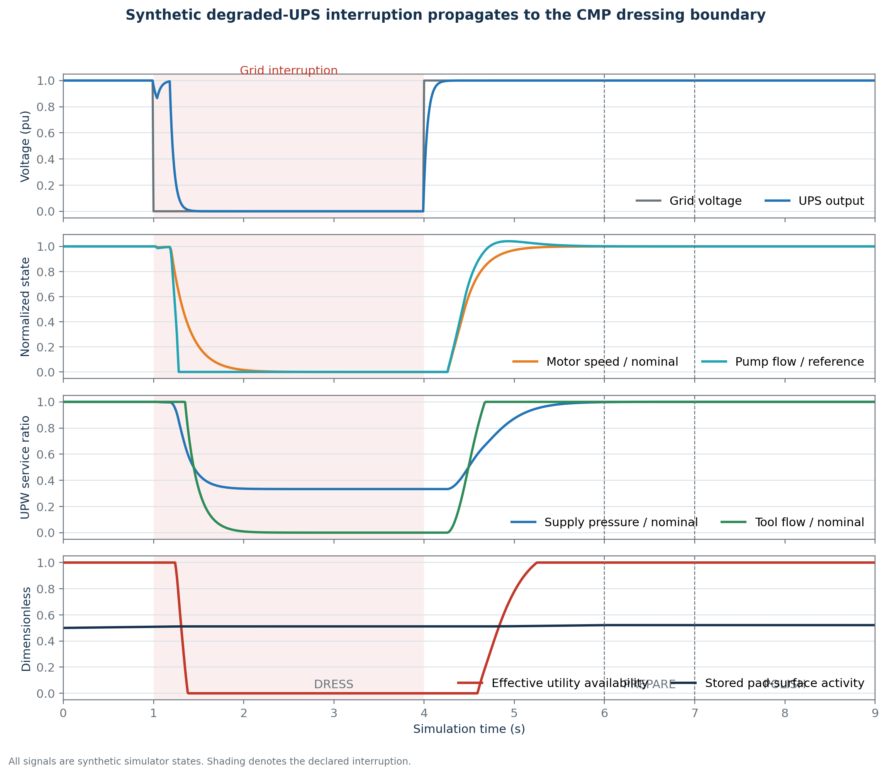
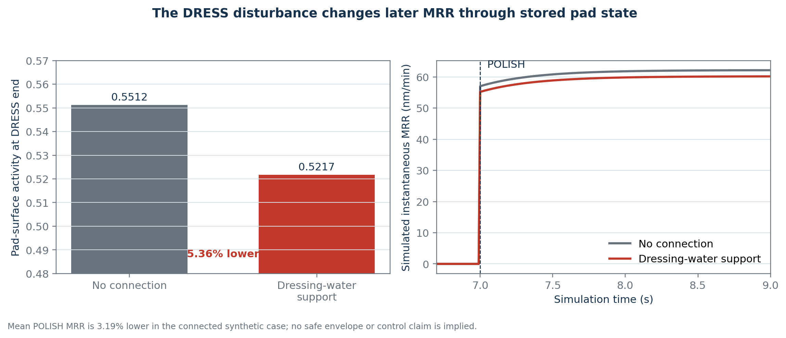
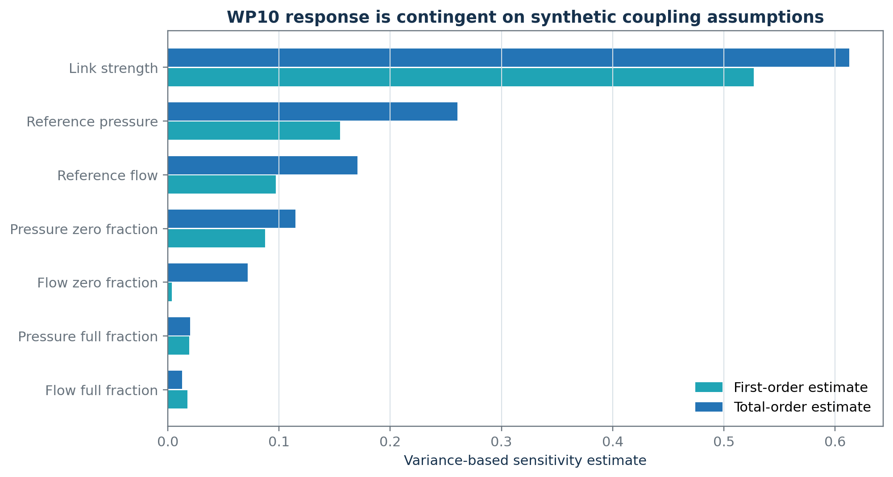

## Status of this demonstration

> **Interim scope:** validated synthetic plant, standalone CMP physics, and declared utility-to-CMP coupling through WP10.

- Predictive warning, root-cause classification, controller comparison, and independent safety filtering are **not yet implemented**.
- PHM 2016 integrity and preprocessing are audited, but public-data model performance is still pending.
- No physical-defect, yield, equipment-protection, real-fab, or production-control claim is made.

## Research question

Can a predictive supervisory layer detect an upcoming **simulated average-MRR excursion** caused by electrical and UPW disturbances, then reduce it relative to no intervention and fixed-threshold control without violating predefined simulation constraints?

Current evidence answers only the prerequisite question:

> Can the simulator propagate a declared disturbance through a defensible, explicit topology while preserving structural negative controls?

## Architecture and completion boundary

{width=96%}

## Two evidence planes remain separate

**Public-data plane**

- User-supplied PHM 2016 archive; exact checksums and schema audit
- 1,981/424/424 train/test/validation wafer-stage records
- Native, source-undeclared target unit; no silent SI conversion
- Virtual-metrology fitting and held-out metrics pending

**Synthetic simulator plane**

- Canonical SI units and declared component equations
- Latent state separated from observed sensor state
- Simulator states support internal causal-chain testing only

## WP08: reduced-order CMP physics

The normalized generalized-Preston model is

$$
R_{eq}=\chi_p R_0\Phi_{PV}m_s m_T m_{pad}m_{recipe},
$$

with

$$
\Phi_{PV}=\frac{1}{A}\int_A
\left(\frac{P}{P_0}\right)^\alpha
\left(\frac{v_R}{V_0}\right)^\beta dA.
$$

- Explicit PREPARE, POLISH, DRESS, HOLD, RECOVER, COMPLETE modes
- Dynamic pressure, signed spindles, slurry, pad, dresser, and temperature
- Cumulative removal and active-polish time prevent hold-based metric gaming
- Nominal synthetic reference: 100 nm/min

## WP08 deterministic reference

{width=94%}

## WP10: coupling without a hidden MRR gain

For normalized pressure $p$ and flow $q$,

$$
a_h=\min\{R(p;p_0,p_1),R(q;q_0,q_1)\},\qquad
a_{eff}=1-\lambda(1-a_h).
$$

| Topology | Boundary effect |
|---|---|
| `NO_CONNECTION` | Exact neutral default |
| `DRESSING_WATER_SUPPORT` | Changes conditioning during DRESS |
| `THERMAL_LOOP` | Changes coolant boundary/conductance |
| `SYNTHETIC_SLURRY_SUPPORT` | Explicit artificial structural case |

Every numerical coupling coefficient is a **synthetic assumption**.

## Negative control: healthy UPS ride-through

{width=94%}

- Minimum UPS output: 0.865536 pu
- Maximum pressure deviation: approximately 1.12 kPa
- Tool flow unchanged
- Connected and no-connection CMP traces exactly identical

## Positive declared chain

{width=92%}

The positive case is a deliberately degraded 500 J UPS stress test—not a real UPS specification.

## Delayed pad-memory result

{width=82%}

- End-of-DRESS pad activity: **5.36% lower**
- Mean subsequent simulated MRR: **3.19% lower**
- No safe MRR envelope is frozen; this is not a controlled excursion or quality outcome.

## Sensitivity is part of the result

{width=74%}

- Saltelli pick-freeze: 4,096 base samples; 36,864 seeded evaluations; zero link recovers no connection.
- **Interpretation:** the ranking is conditional—not empirical importance or causal proof.

## Validation inventory

- 154/154 complete repository tests passed
- 50/50 WP10-impacted tests passed
- Exact no-connection, zero-link, nominal-service, and default thermal-MRR nulls
- Pump-curve residual $< 6\times10^{-11}$ Pa
- Hydraulic mass residual $< 10^{-12}$ m$^3$/s
- R3/R4/WP08 historical artifacts reproduced exactly
- Schema/interface: 2.4.0/3.2.0; `DynamicSubsystem` remains 2.0.0

## What is not shown yet

- PHM virtual-metrology baseline and hybrid-model results (WP09)
- Frozen MRR envelope, warning horizon, censoring, and uncertainty calibration (WP12)
- Root-cause attribution including `UNKNOWN` and compounds (WP13)
- No-action and threshold baselines (WP14)
- Predictive bounded controller objective/actions (WP15)
- Independent safety filter and restart rules (WP16)
- Three-controller paired evaluation and final demonstration (WP17–WP18)

## Phase 3 roadmap

1. Freeze safe MRR envelope, persistence, horizon, feature cutoff, and uncertainty
2. Complete PHM virtual metrology and synthetic early warning
3. Freeze and evaluate attribution policy
4. Freeze controller objective, action grid, and latency budget
5. Freeze independent safety and restart constraints
6. Close Phase 3 and switch to routine Phase 4 integration if stable

## Takeaway

WP10 establishes a scientifically controlled simulation foundation:

- The utility-to-CMP connection is explicit and typed.
- Healthy ride-through remains a negative control.
- The positive effect is delayed through pad-state memory.
- Structural and parameter uncertainty are visible rather than hidden.

**Predictive-control efficacy remains the next research result—not a completed claim.**

## Selected technical sources

- Preston (1927), empirical pressure–velocity polishing relation
- White, Melvin & Boning (2003), DOI: 10.1149/1.1560642
- Kim et al. (2005), DOI: 10.1016/j.mee.2005.07.080
- Mudhivarthi et al. (2006), DOI: 10.1149/1.2177007
- Chang et al. (2007), DOI: 10.1016/j.mee.2006.11.011
- Bahr et al. (2017), DOI: 10.3390/mi8060170

Full provenance and claim limitations are recorded in the repository.
